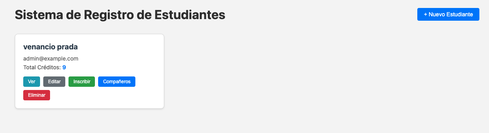
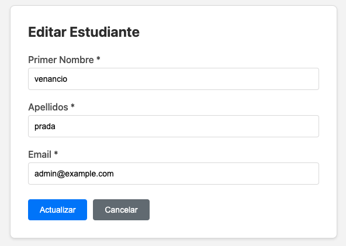
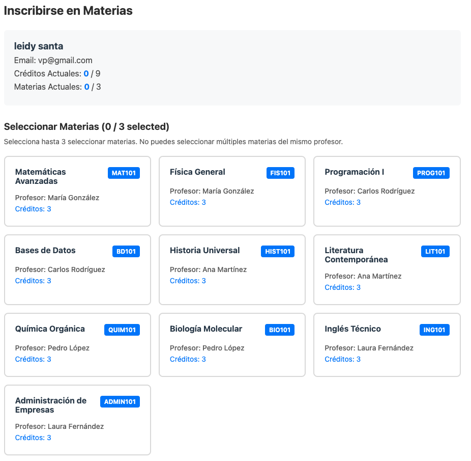

# Sistema de Registro de Estudiantes (Frontend)

Este proyecto es una aplicación web desarrollada en Angular que permite la gestión de estudiantes, incluyendo su registro, edición y la inscripción en materias académicas.

## Descripcion

El objetivo de esta aplicación es proveer una interfaz amigable para administrar la información académica de los estudiantes. Interactúa con un backend (API) para persistir los datos de alumnos, profesores y materias.

## Caracteristicas

- Gestion de Estudiantes: Listar, crear, editar y eliminar estudiantes.
- Inscripcion de Materias: Permitir a los estudiantes inscribirse en materias disponibles, validando creditos y restricciones (como no repetir profesor).
- Vista de Compañeros: Visualizar a otros estudiantes inscritos en las mismas materias.
- Internacionalizacion: Soporte para cambio de idioma (Español/Ingles).

## Requisitos Previos

Asegurese de tener instalado:

- Node.js (version 18 o superior recomendada)
- npm (gestor de paquetes de Node)

## Instalacion

1. Clone este repositorio o descargue el codigo fuente.
2. Abra una terminal en la carpeta raiz del proyecto.
3. Instale las dependencias ejecutando:

npm install

## Ejecucion en Desarrollo

Para iniciar el servidor de desarrollo, ejecute:

npm start

O directamente con Angular CLI:

ng serve

La aplicacion estara disponible en http://localhost:4200/. La aplicacion se recargara automaticamente si cambia algun archivo fuente.

## Construccion para Produccion

Para generar los archivos de produccion (optimizado), ejecute:

npm run build

Los archivos generados se almacenaran en el directorio dist/.

## Estructura del Proyecto

- src/app/components: Contiene las vistas principales (lista, formulario, inscripcion).
- src/app/services: Servicios para la comunicacion con la API y gestion de estado.
- src/app/models: Definiciones de tipos e interfaces TypeScript.
- src/app/constants: Textos y constantes de la aplicacion.

## Consideraciones

Este frontend espera conectarse a una API backend. Verifique la configuracion en src/app/services/api.config.ts para asegurar que los endpoints apunten al servidor correcto.

